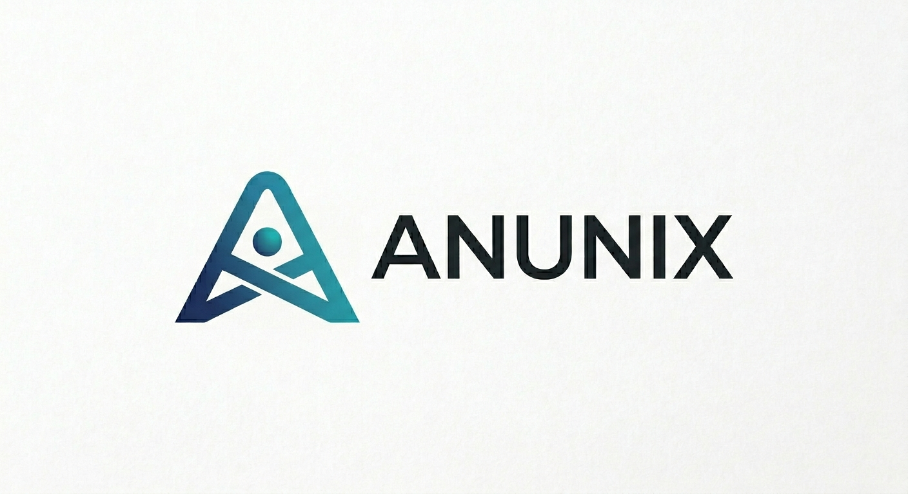

<p align="center">
  
</p>

<p align="center">
  <strong>The AI-Native Operating System</strong><br>
  Redefining UNIX primitives around state, transformation, memory, routing, and validation.<br>
  Written in C and assembly. No C++, no Rust, no Go.
</p>

<p align="center">
  
  
  
  
</p>

---

## What It Does

Anunix replaces classical UNIX abstractions with primitives designed for AI-native workloads:

| UNIX | Anunix | Why |
|------|--------|-----|
| Files | **State Objects** | Content-addressed, versioned, with provenance |
| Processes | **Execution Cells** | Lifecycle-managed, composable, with resource budgets |
| `malloc`/`mmap` | **Memory Planes** | Tiered memory with semantic decay and promotion |
| Pipes | **Routing Plane** | Type-aware routing with pluggable transformation engines |
| Sockets | **Network Plane** | Federated execution across machines |
| `chmod`/ACLs | **Capabilities** | Object-level, unforgeable, delegatable |
| Model servers | **Model Hosting** | Kernel control plane for model lifecycle, leasing, and routing |
| `.env` files | **Credential Objects** | Kernel-enforced secrets with opaque payloads and scoped access |

## Release: 2026.4.18

### Milestone: Tensor-native kernel + HTTP API + SSH server

Anunix now treats **tensors as first-class kernel citizens** (RFC-0013) and speaks both **HTTP and SSH** to the outside world.  Agents and humans can connect to a running instance over the network, create tensors, run operations, inspect state, and script workflows end-to-end.

```
$ ssh -i ~/.ssh/id_ed25519 -p 12222 anunix@jekyll -- tensor stats default:/weights
  shape: [128, 64], dtype: int8
  mean:     63.500
  variance: 1365.250
  l2_norm:  44216320.000
  sparsity: 0.062
  min:      0.000
  max:      127.000

$ curl -X POST http://jekyll:18080/api/v1/exec \
    -d '{"command": "tensor matmul default:/a default:/b default:/c"}'
{"status": "ok", "output": "matmul -> [4,4] int8 (0 cycles)\n"}
```

### What's new in 2026.4.18

**Tensors (RFC-0013)** — four phases of tensor + model support
- `ANX_OBJ_TENSOR` State Object with shape, dtype, and BRIN statistics
- Softfloat IEEE 754 arithmetic via integer registers (`-mgeneral-regs-only`)
- `tensor create|info|stats|fill|slice|diff|quantize|search|matmul|relu|transpose|softmax`
- Model namespace (`models:/<name>/layers/...`) with safetensors import
- CPU reference math engine, operation dispatch through the Routing Plane
- SGD optimizer step with provenance, checkpoint/verify

**HTTP API server** on port 8080
- `GET /api/v1/health` — liveness probe
- `POST /api/v1/exec` — run any ansh command, returns JSON with captured output
- Output capture hooks into kprintf for structured responses

**SSH-2.0 server** on port 22
- curve25519-sha256 key exchange, ssh-ed25519 host key, chacha20-poly1305 transport
- Password and public-key authentication
- Interactive shell + `ssh host -- cmd` exec mode
- Host key persisted in the kernel credential store

**Crypto primitives** in `kernel/lib/crypto/`
- SHA-256 (streaming), SHA-512, HMAC-SHA-256
- ChaCha20, Poly1305, AES-256-CTR
- Curve25519 ECDH, Ed25519 sign/verify
- CSPRNG with RDRAND detection + TSC fallback
- RFC 8032 and RFC 7539 test vectors pass; fuzzed against Python reference

**Claude Code skills** in `.claude/skills/`
- `/anunix-build`, `/anunix-deploy`, `/anunix-exec`, `/anunix-test`
- Package the build-deploy-test loop into one-shot slash commands

### Earlier milestone: First Claude API call from bare metal (2026.4.16)

Anunix can talk to Claude from a cold boot. The kernel initializes its own networking stack, reads API credentials from a kernel-enforced secret store, builds a JSON request, sends it over TCP through a TLS proxy, parses the response, and displays Claude's answer — all in ~25,000 lines of C running on bare metal with no libc, no OS underneath.

```
anx> secret set anthropic-api-key sk-ant-api03-...
anx> model-init anthropic-api-key 10.0.2.2 8080
anx> ask Hello from Anunix

thinking...

Hello! How can I help you today?

[32 in / 12 out tokens]
```

### What's in the 2026.4.16 release

**Kernel Subsystems (RFC-0001 through RFC-0008)**
- State Object Layer, Execution Cell Runtime, Memory Control Plane
- Routing Plane with staged model hosting, budget profiles, route feedback
- Network Plane (stub — local node registry)
- Capability Objects with trust lifecycle
- Credential Objects (RFC-0008) — kernel-enforced secrets management

**Networking**
- PCI bus enumeration with device class decode
- Virtio-net driver (legacy PIO transport)
- Full IP stack: Ethernet, ARP, IPv4, ICMP, UDP, TCP
- DNS resolver (A records via UDP)
- HTTP/1.1 client with auth header injection
- `ping`, `dns`, `http-get`, `api` shell commands

**Storage**
- Virtio-blk driver (sector read/write, 3-descriptor chains)
- Journaled on-disk object store (write-ahead log, OID index)
- GPT partition table creation (EFI + Anunix data partition)

**Hardware Discovery**
- ACPI table parsing (RSDP, RSDT/XSDT, MADT for CPU/IOAPIC count)
- Extended PCI device decode (20+ device class names)
- `hw-inventory` command with ACPI + PCI + block + network summary

**AI Integration**
- Claude Messages API client with JSON request/response
- Credential-gated authentication (x-api-key injection)
- `ask` command with model override (`ask -m model-id message`)
- Default model: `claude-sonnet-4-6`
- JSON parser (recursive descent, tree queries)

**Authentication**
- Multi-key user accounts (password + SSH public key)
- SHA-256 password hashing (full software implementation)
- Per-key scopes: console, credentials, objects, admin
- Login/logout sessions with scope tracking
- `useradd`, `login`, `logout` shell commands

**Security**
- Credential payloads never in traces, provenance, kprintf, or network messages
- Constant-time hash comparison for authentication
- Secure zeroing of secrets on revoke/rotate (compiler-safe)
- Command history scrubs `secret set` and `useradd` values
- Boot-time credential provisioning via multiboot command line

**Platform**
- Boots on real UEFI hardware (AMD Ryzen 9 HX 370, 96GB RAM)
- Bootable ISO (BIOS + UEFI) for USB installation
- 4GB identity mapping via 1GB pages for framebuffer/MMIO access
- COM1 detection for headless vs graphical boot
- Framebuffer console with ANSI color splash
- Command history with up/down arrow keys (32 entries)
- 12 passing unit tests
- CalVer versioning (YYYY.M.D)

### Known Issues

- Subsequent `ask` calls after the first may fail (TCP connection cleanup)
- TLS requires a host-side proxy (`socat` to api.anthropic.com)
- No DHCP client yet (network config hardcoded for QEMU user-mode)
- No persistent storage of user accounts or credentials across reboot

## Target Platforms

| Platform | Architecture | Status |
|----------|-------------|--------|
| QEMU virt (ARM64) | AArch64 | Boots, all subsystems |
| QEMU (x86_64) | x86_64 | Boots, networking, Claude API |
| QEMU + OVMF (UEFI) | x86_64 | Boots, networking, Claude API |
| AMD Ryzen 9 HX 370 | x86_64 | Boots (USB ISO, framebuffer) |
| Apple Silicon Macs | AArch64 | Planned |
| Framework Laptop 16 | x86_64 | Planned |
| Framework Desktop | x86_64 | Planned |

## Building

### Prerequisites

- macOS with Xcode Command Line Tools (`xcode-select --install`)
- No Homebrew required

### One-time setup

```sh
make toolchain         # Fetch ld.lld + llvm-objcopy
make qemu-deps         # Build QEMU from source (~5 min)
make iso-deps          # Fetch GRUB + xorriso for ISO builds
```

### Build and run

```sh
make kernel            # Build for host architecture
make kernel ARCH=x86_64 # Build for x86_64
make qemu              # Boot in QEMU, serial console
make test              # Run unit tests (12 tests)
make iso               # Build bootable x86_64 ISO (BIOS + UEFI)
```

### Talk to Claude

```sh
# Terminal 1: TLS proxy
socat TCP-LISTEN:8080,fork,reuseaddr OPENSSL:api.anthropic.com:443,verify=1 &

# Terminal 2: Boot Anunix with networking
qemu-system-x86_64 -m 512M -nographic -serial mon:stdio -no-reboot \
  -netdev user,id=n0 -device virtio-net-pci,netdev=n0 \
  -kernel build/x86_64/anunix-qemu.elf

# In the Anunix shell:
anx> secret set anthropic-api-key sk-ant-api03-YOUR-KEY
anx> model-init anthropic-api-key 10.0.2.2 8080
anx> ask What is the meaning of life?
```

### HTTP and SSH access

Boot with port forwarding to get programmatic + shell access from the host:

```sh
qemu-system-x86_64 -m 512M -nographic -no-reboot -serial mon:stdio \
  -netdev user,id=n0,hostfwd=tcp::18080-:8080,hostfwd=tcp::12222-:22 \
  -device virtio-net-pci,netdev=n0 \
  -kernel build/x86_64/anunix-qemu.elf &

# HTTP API:
curl http://localhost:18080/api/v1/health
curl -X POST http://localhost:18080/api/v1/exec \
  -H 'Content-Type: application/json' \
  -d '{"command": "tensor create default:/w 4,4 int8"}'

# SSH (password "anunix" or pubkey):
ssh -p 12222 anunix@localhost -- sysinfo
ssh -i ~/.ssh/id_ed25519 -p 12222 anunix@localhost   # interactive shell
```

## Project Structure

```
kernel/
  arch/
    arm64/            ARM64: PL011 UART, boot, page tables
    x86_64/           x86_64: COM1 serial, multiboot, IDT, PIC, PIT
  core/
    state/            State Object Layer + disk store   (RFC-0002)
    exec/             Execution Cell Runtime            (RFC-0003)
    mem/              Memory Control Plane              (RFC-0004)
    route/            Routing Plane + Model Hosting     (RFC-0005)
    sched/            Unified Scheduler                 (RFC-0005)
    net/              Network Plane                     (RFC-0006)
    cap/              Capability Objects                (RFC-0007)
    tensor/           Tensor Objects + math engine      (RFC-0013)
    tools/            ansh command handlers (ls, tensor, model, etc.)
    agent/            Model API client
    install/          GPT partitioning
    credential.c      Credential Store                  (RFC-0008)
    auth.c            Multi-key Authentication
    shell.c           Interactive kernel monitor (ansh)
    main.c            Kernel entry point
  drivers/
    fb/               Framebuffer + console
    pci/              PCI bus enumeration
    virtio/           Virtio transport, net, blk drivers
    net/              IP stack (Eth/ARP/IPv4/ICMP/UDP/TCP/DNS/HTTP)
                        tcp_server.c — server-side TCP (listen/accept)
                        httpd.c      — HTTP API endpoint
                        sshd.c       — SSH-2.0 server
    acpi/             ACPI table parsing
  include/anx/        Public kernel headers
  lib/
    crypto/           SHA-256/512, ChaCha20, Poly1305, AES, Curve25519, Ed25519
    (kprintf, alloc, json, font, hashtable, jpeg, etc.)
tests/                Host-native unit tests (17 suites)
tools/                Build scripts
.claude/skills/       Claude Code slash commands for Anunix workflows
assets/               Brand assets (logo)
docs/rfcs/            Design specifications
config/               GRUB boot configuration
```

## Companion repos

- `~/Development/Anunix-tools/` — deployment scripts, integration tests, SSH protocol diagnostic
- `~/Development/Anunix-Browser/` — collaborative web browser daemon with Anunix bridge

## Design Documents

| RFC | Title | Status |
|-----|-------|--------|
| [RFC-0001](docs/rfcs/RFC-0001-architecture-thesis.md) | Architecture Thesis | Draft |
| [RFC-0002](rfcs/RFC-0002-state-object-model.md) | State Object Model | Draft |
| [RFC-0003](docs/rfcs/RFC-0003-execution-cell-runtime.md) | Execution Cell Runtime | Draft |
| [RFC-0004](docs/rfcs/RFC-0004-memory-control-plane.md) | Memory Control Plane | Draft |
| [RFC-0005](docs/rfcs/RFC-0005-routing-and-scheduler.md) | Routing Plane and Unified Scheduler | Draft |
| [RFC-0006](docs/rfcs/RFC-0006-network-plane.md) | Network Plane and Federated Execution | Draft |
| [RFC-0007](docs/rfcs/RFC-0007-capability-objects.md) | Capability Objects | Draft |
| [RFC-0008](docs/rfcs/RFC-0008-credential-objects.md) | Credential Objects and Secrets Management | Draft |
| [RFC-0013](docs/rfcs/RFC-0013-tensor-objects.md) | Tensor Objects and Model Representation | Draft (impl complete) |

## Roadmap

### 2026.4.16 — Agent Memory + Installer

- **RFC-0009: Agent Memory** — episodic memory with graph metadata, kernel-level embedding for semantic retrieval, access-based decay with relevance scoring, "dream" consolidation during utilization minima
- **Text-based installer** with kickstart-style JSON provisioning (State Object)
- **DHCP client** for network-at-install-time
- **Fix: TCP connection reuse** for sequential `ask` calls
- **Persistent storage** of credentials and user accounts across reboot

### 2026.5 — Minimum Viable Agent

- **Agent cell runtime** — perceive/plan/act/observe loop
- **Remote memory** — distributed access via raw mounts (flat networks) or trust-zone peers
- **Graphical installer** (after text installer validation)
- **In-kernel TLS 1.3** (BearSSL port or minimal subset)
- Real hardware validation: Framework Laptop 16 → M1 Mac Studio

### Future

- Phone-class deployment target
- Multi-agent coordination with scoped memory
- AHCI/NVMe storage drivers for real hardware
- Capability learning from execution traces (RFC-0007 Phase 2)

## License

MIT
