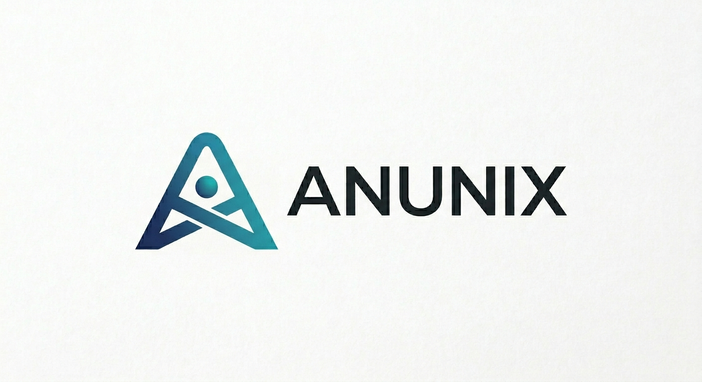

<p align="center">
  
</p>

<p align="center">
  <strong>The AI-Native Operating System</strong><br>
  Redefining UNIX primitives around state, transformation, memory, routing, and validation.<br>
  Written in C and assembly. No C++, no Rust, no Go.
</p>

<p align="center">
  
  
  
  
  
</p>

---

## Try It Now

```sh
git clone https://github.com/AdamPippert/Anunix.git
cd Anunix
make toolchain   # one-time: fetches ld.lld + llvm-objcopy
./run.sh         # builds the kernel if needed and launches in QEMU
```

`run.sh` accepts `--arch x86_64|arm64`, `--mem 1G`, and `--fb` (framebuffer display).
For lower-level control, `make qemu` / `make qemu-fb` / `make qemu-fb-net` still work.

**New here?** Read [docs/CONCEPTS.md](docs/CONCEPTS.md) — a 60-second map of
Anunix's core primitives and how they map to UNIX abstractions you already know.

---

## What It Does

Anunix replaces classical UNIX abstractions with primitives designed for AI-native workloads:

| UNIX | Anunix | Why |
|------|--------|-----|
| Files | **State Objects** | Content-addressed, versioned, with provenance |
| Paths | **UOR Coordinates** | Topological identity derived from a canonical manifest (RFC-0002 §14) |
| Processes | **Execution Cells** | Lifecycle-managed, composable, with resource budgets |
| `malloc`/`mmap` | **Memory Planes** | Tiered memory with semantic decay and promotion |
| Pipes | **Routing Plane** | Type-aware routing with pluggable transformation engines |
| Sockets | **Network Plane** | Federated execution across machines |
| `chmod`/ACLs | **Capabilities** | Object-level, unforgeable, delegatable |
| Model servers | **Model Hosting** | Kernel control plane for model lifecycle, leasing, and routing |
| `.env` files | **Credential Objects** | Kernel-enforced secrets with opaque payloads and scoped access |
| GRUB | **anxboot** | Custom UEFI loader, no second-stage, no GNU EFI, no edk2 |
| `mdadm` | **Software RAID** | Kernel-assembled striped and mirrored arrays under the object store |

---

## Release: 2026.8.30

### Milestone: Prism support

Real code from `UOR-Foundation/prism` — the standard-library layer
`Hologram-Technologies/hologram` builds on — now runs on Anunix
independently of Hologram. Getting a correct result surfaced a third
real Anunix bug: the syscall trap did not preserve `rcx` and
`r8`-`r11` across its call into C, corrupting a ring-3 program's own
register state on every syscall.

```
anx> exec /bin/prism5
prism_tensor::CpuI8MatmulSquare<4> on Anunix (real UOR-Foundation/prism code):
0 -1 -2 -3 1 0 -1 -2 2 1 0 -1 3 2 1 0
exec: exit_status=0
```

**What's new in 2026.8.30**

- **Real Prism code runs, independently of Hologram** —
  `uor-prism-tensor::CpuI8MatmulSquare<4>` computes a signed `4 × 4`
  integer matrix product and returns the exact expected result
- **A third real Anunix bug fixed** — `isr_stub_syscall` now saves and
  restores `rcx` and `r8`-`r11` around its call into `anx_syscall_trap`,
  so a syscall no longer silently overwrites a ring-3 program's own
  values in those registers
- **The syscall ABI doc states what it always should have** —
  `kernel/include/anx/posix.h` now documents that every register except
  `rax`, `rdi`, `rsi`, and `rdx` survives a syscall unchanged
- **59 host-native tests still pass**

See [`RELEASE-2026.8.30.md`](RELEASE-2026.8.30.md) for the full
register-corruption story and its relationship to the Hologram work
below.

---

## Earlier releases

### 2026.8.28-1 — Real ELF execution

Anunix executes a foreign binary in ring 3 for real: segment loading,
a syscall trap, and `ANX_SYSCALL_EXIT` replace the old simulated exec
stub. A real Rust `no_std` binary and real `Hologram-Technologies/hologram`
code (dtype logic, a matmul kernel, and the compiler-and-executor round
trip) all run on Anunix, surfacing a real stack-alignment bug along the
way. 59 tests, up from 50. See [`RELEASE-2026.8.28-1.md`](RELEASE-2026.8.28-1.md).

### 2026.5.8 — Topological organization of State Objects

Every State Object carries a deterministic, content-derived **UOR —
Universal Object Reference** alongside its OID and content hash, and a
new **anxboot** custom UEFI loader replaces GRUB. The disk store's sorted
index keys on the UOR-derived `boundary_key`, giving locality-ordered
range scans. The `anunixmacs` editor is renamed to `amacs`. 50 new tests.
See [`RELEASE-2026.5.8.md`](RELEASE-2026.5.8.md).

### 2026.4.24 — Native in-kernel browser engine (superseded)

Anunix originally shipped a complete HTML/CSS/JS browser engine in the
kernel — no external process, no Playwright. It was later found to violate
Anunix's own boundary decision
([`docs/plans/graphical-userspace-platform/00-boundary-decision.md`](docs/plans/graphical-userspace-platform/00-boundary-decision.md)),
which prohibits an in-kernel or core-userland browser engine, and has been
removed from `kernel/drivers/browser/` and ported unchanged to the external
[Anunix-Browser](https://github.com/anunix/Anunix-Browser) project (as
`engine/`, building standalone as `libanxengine`). `anx_browser_init(9191)`
and the native-engine path no longer exist in this repo; `browser_init`
connects to an external `anxbrowserd` instance instead (see 2026.4.19
below). See [`RELEASE-2026.4.24.md`](RELEASE-2026.4.24.md) for the
historical record of the original release.

### 2026.4.23 — Graphical userspace complete (P1/P2)

All 10 graphical-userspace tickets closed: multi-window/surface model
hardening, clipboard + drag-and-drop, UTF-8 text shaping, transfer policy
hooks, accessibility tree, media pipeline, process isolation, conformance
gate, and crash diagnostics. 41 tests passing.
See [`RELEASE-2026.4.23.md`](RELEASE-2026.4.23.md).

### 2026.4.22 — Desktop environment, window manager, AI world model

Anunix boots into a full graphical desktop — 9 virtual workspaces, focus
cycling, menu bar, workflow designer, and object store browser, all in C.
The **JEPA world model** (`kernel/core/jepa/`) observes scheduler, memory,
and routing counters; the **Iterative Belief-Action Loop** (RFC-0020) feeds
back into route scoring and the RLM policy loop.
See [`docs/releases/2026.4.22.md`](docs/releases/2026.4.22.md).

### 2026.4.19 — Graphical browser streaming

Browser Renderer Cell streams JPEG from an external `anxbrowserd` at
~30 FPS. GOP mode enumeration auto-selects the highest-res BGRX8888 mode,
DPI-aware font scaling, PIT-driven frame scheduler, `fb_info`/`gop_list`/
`fb_test` shell commands.
See [`RELEASE-2026.4.19.md`](RELEASE-2026.4.19.md).

### 2026.4.18 — Tensor-native kernel + HTTP API + SSH server

Tensors as first-class kernel citizens (RFC-0013): `ANX_OBJ_TENSOR` with
shape, dtype, and BRIN statistics; softfloat IEEE 754 via integer registers;
`tensor create|info|stats|fill|slice|diff|quantize|search|matmul|relu|transpose|softmax`.
**HTTP API** on :8080 and **SSH-2.0 server** on :22 (curve25519 + chacha20-poly1305,
password or ed25519 pubkey). Full crypto primitives in `kernel/lib/crypto/`.
See [`RELEASE-2026.4.18-1.md`](RELEASE-2026.4.18-1.md).

### 2026.4.16 — First Claude API call from bare metal

Anunix talks to Claude from a cold boot: own networking stack, kernel-enforced
secret store, JSON request through a TLS proxy, response displayed — all in
~25,000 lines of C with no libc and no OS underneath. PCI, virtio-net, full
IP stack (Eth/ARP/IPv4/ICMP/UDP/TCP), DNS, HTTP/1.1, journaled disk store,
GPT partitioning, ACPI parsing, multi-key authentication.
See [`RELEASE-2026.4.16.md`](RELEASE-2026.4.16.md).

---

## Subsystems

### Kernel core (`kernel/core/`)

| Subsystem | RFC | What it does |
|-----------|-----|--------------|
| `state/` | 0002 | State Objects: lifecycle, disk store, provenance, access, transfer, namespace |
| `uor/` | 0002 §14 | Universal Object Reference — topological coordinates + boundary keys |
| `exec/` | 0003 | Execution Cells: lifecycle, browser cell, model server, VM cell |
| `mem/` | 0004 | Memory Planes — tiered memory with semantic decay |
| `route/` | 0005 | Routing Plane — type-aware transformation, topology affinity scoring |
| `sched/` | 0005 | Unified scheduler with priority + QoS event queues |
| `net/` | 0006 | Network Plane — DAG edges, zero-copy data plane |
| `cap/` | 0007, 0028, 0029 | Capability Objects, trust lifecycle, information-flow labels, the Prepare/Dispatch/Settle effect protocol, measured-null promotion gate |
| `cred` | 0008 | Credential store — opaque payloads, scoped access |
| `agent/` | 0009 | Agent memory and execution lifecycle |
| `posix/` | 0010 | POSIX shim: file/process syscalls, real ring-3 ELF exec |
| `icm/` | 0025 | Information Context Management over State Objects |
| `twin/` | 0029 | Resource Twin — measured resource state for the scheduler |
| `regime/` | 0029 | Regime Detector — workload-regime classification for scheduling policy |
| `iface/` | 0012 | Interface Plane — surfaces, events, accessibility, clipboard, drag-drop, media, shm IPC |
| `tensor/` | 0013 | Tensor Objects + math engine (matmul, ReLU, quantize, BRIN stats) |
| `vm/` | 0017 | VM Objects — dual-nature primitives |
| `workflow/` | 0018 | Workflow Objects — graph-structured execution, bundles, library |
| `wm/` | 0018 | Window manager: terminal, taskbar, menubar, hotkeys, app menu, switcher, agent surface |
| `apps/` | 0023 | `amacs` editor (eLISP), `video_player`, `object_viewer`, `workflow_designer`, terminal |
| `audio/` | 0024 | Audio sink + processing pipeline |
| `video/` | 0024 | Video player and sink |
| `anxml/` | 0021 | Inference runtime |
| `ebm/` | 0020 | Energy-Based Model — world model, constraint, goal, uncertainty |
| `jepa/` | 0020 | Joint Embedding Predictive Architecture — encoder, predictor, trajectory ring, online learning |
| `loop/` | 0020 | Iterative Belief-Action Loop — belief, goal inference, LLM proposals, PAL scoring, branch/merge |
| `rlm/` | 0020 | Reinforcement Learning Manager — batch learning, rollout, PAL integration |
| `log/` | — | Persistent boot-session logging with retention policy |
| `update/` | — | System update + versioning |
| `install/` | — | Installer + provisioning |
| `pal` | — | Cross-boot persistence via disk object store |

### Drivers (`kernel/drivers/`)

| Class | Drivers |
|-------|---------|
| Storage | `ahci` (SATA), `nvme`, `apple_ans` (Apple NVMe), `virtio_blk`, generic `blk` |
| Network | `e1000`, `virtio_net`, `wifi/` (MT7925 RZ717), full IP stack (`eth`, `arp`, `ipv4`, `icmp`, `udp`, `tcp`, `dns`, `dhcp`, `ntp`, `http`, `httpd`, `sshd`, `tcp_server`) |
| Audio | `hda` (Intel HD Audio), `apple_audio` |
| Accel | `xdna` (AMD Ryzen AI NPU) |
| Display | `fb`, `fbcon`, `gui`, UEFI GOP |
| Input | `usb_mouse` (HID boot protocol), PS/2 keyboard |
| Bus | `pci`, `acpi`, `virtio` |
| Browser | `browser/` — HTML, CSS, JS VM, layout, paint, JPEG/PNG/WebP, forms, PII filter, WebSocket |

### Userland shell (`ansh`)

Built-in commands in `kernel/core/tools/`: `appendb64`, `bootlog`, `browser`, `cat`, `cells`, `conformance`, `cp`, `display` (`fb_info`/`gop_list`/`fb_test`), `exec`, `fetch`, `hwd`, `iface_tools`, `inspect`, `kickstart`, `ls`, `meta`, `model`, `mv`, `netinfo`, `rm`, `search`, `sysinfo`, `tensor`, `theme`, `uor`, `vm`, `wifi`, `workflow`, `write`. Plus `agent` (LLM+shell loop), `ask` (Claude API), `ssh-keygen`, pipe chaining, history persistence, scripting (`if/then/end`, `$?`).

---

## Target Platforms

| Platform | Architecture | Status |
|----------|-------------|--------|
| QEMU x86_64 (BIOS + UEFI) | x86_64 | All subsystems |
| QEMU virt | ARM64 | Boots, all subsystems |
| AMD Ryzen 9 HX 370 (Framework Laptop 16) | x86_64 | Boots, USB ISO, framebuffer, NVMe, e1000, WiFi |
| Framework Desktop | x86_64 | Brought up via GLI KVM, in active testing |
| Apple Silicon (M1/M2/M3) | ARM64 | Build only; native boot in progress (AGX driver, RFC-0022) |

---

## Building

### Prerequisites

- Linux (Arch, Debian, Fedora) or macOS with Xcode Command Line Tools
- `make`, `clang`, `git`
- `qemu-system-x86_64` / `qemu-system-aarch64` for VM testing

### One-time setup

```sh
make toolchain      # Fetch ld.lld + llvm-objcopy into tools/llvm/bin/
make iso-deps       # (optional) fetch syslinux + xorriso for ISO builds
make qemu-deps      # (optional) build QEMU from source
```

### Common targets

```sh
make kernel                  # Build for host architecture
make kernel ARCH=x86_64      # Build for x86_64
make kernel ARCH=arm64       # Build for ARM64
make qemu                    # Boot in QEMU, serial console
make qemu-raid               # Boot with three NVMe drives for software RAID
make qemu-fb                 # Boot with framebuffer
make qemu-fb-net             # Boot with framebuffer + networking
make qemu-iso                # Boot the bootable ISO under QEMU/UEFI
make iso                     # Build bootable USB ISO (UEFI-only, anxboot)
make efi-stub                # Build anxboot.efi standalone
make test                    # Run host-native unit tests
make conformance             # Run conformance gate fixture suite
make clean
```

### Networking, HTTP, SSH

```sh
qemu-system-x86_64 -m 1G -no-reboot -serial mon:stdio \
  -netdev user,id=n0,hostfwd=tcp::18080-:8080,hostfwd=tcp::12222-:22 \
  -device virtio-net-pci,netdev=n0 \
  -kernel build/x86_64/anunix-qemu.elf

# HTTP API
curl http://localhost:18080/api/v1/health
curl -X POST http://localhost:18080/api/v1/exec \
  -H 'Content-Type: application/json' \
  -d '{"command": "tensor create default:/w 4,4 int8"}'

# SSH (password "anunix" or ed25519 pubkey)
ssh -p 12222 anunix@localhost -- sysinfo
ssh -i ~/.ssh/id_ed25519 -p 12222 anunix@localhost   # interactive shell
```

### Talking to Claude

```sh
# Terminal 1: TLS proxy on the host
socat TCP-LISTEN:8080,fork,reuseaddr OPENSSL:api.anthropic.com:443,verify=1 &

# Terminal 2: in the Anunix shell
anx> secret set anthropic-api-key sk-ant-api03-YOUR-KEY
anx> model-init anthropic-api-key 10.0.2.2 8080
anx> ask What is the meaning of life?
```

---

## Project Structure

```
boot/anxboot/         Custom UEFI loader (replaces GRUB)
kernel/
  arch/
    arm64/            ARM64: PL011 UART, boot, MMU, vector table, FP/SIMD
    x86_64/           x86_64: COM1 serial, multiboot2, IDT, PIC, PIT, paging
  core/
    state/  uor/      State Objects + UOR topological identity      (RFC-0002)
    exec/             Execution Cell Runtime                         (RFC-0003)
    mem/              Memory Control Plane                           (RFC-0004)
    route/  sched/    Routing Plane + Unified Scheduler              (RFC-0005)
    net/              Network Plane                                  (RFC-0006)
    cap/              Capability Objects, effect protocol, promotion  (RFC-0007, 0028, 0029)
    posix/            POSIX shim + real ring-3 ELF exec               (RFC-0010)
    icm/              Information Context Management                 (RFC-0025)
    twin/  regime/    Resource Twin + Regime Detector                 (RFC-0029)
    iface/            Interface Plane                                (RFC-0012)
    tensor/           Tensor Objects + math engine                   (RFC-0013)
    vm/               VM Objects                                     (RFC-0017)
    workflow/  wm/    Workflow + window manager                      (RFC-0018)
    apps/             amacs editor, video player, workflow designer  (RFC-0023)
    audio/  video/    Audio engine + media playback                  (RFC-0024)
    anxml/            Inference runtime                              (RFC-0021)
    ebm/  jepa/  loop/  rlm/   IBAL stack — EBM/JEPA/LLM hybrid       (RFC-0020)
    md/               Software RAID — striping and mirroring           (RFC-0030)
    log/              Persistent boot-session logging
    update/  install/ System update and installer
    tools/            ansh command implementations
    agent/            Model API client
    main.c            Kernel entry point
    shell.c           Interactive kernel monitor (ansh)
  drivers/
    storage/          Block device registry, AHCI, NVMe, Apple ANS, virtio-blk
    net/              IP stack, e1000, sshd, httpd, NTP, WiFi
    audio/            HDA, Apple Audio
    accel/            AMD XDNA NPU
    browser/          Native HTML/CSS/JS/image engine
    fb/  input/       Framebuffer + USB HID
    pci/  acpi/  virtio/
  include/anx/        Public kernel headers
  lib/                kprintf, alloc, json, font, hashtable, jpeg, crypto/
distd/                Anunix distribution server (formerly superrouter)
tests/                Host-native unit tests (60 suites)
tools/                Build scripts, ISO builder, QEMU helpers, screenshot
docs/
  CONCEPTS.md         60-second primer on Anunix primitives
  rfcs/               Design specifications (30 RFCs)
  releases/           Per-release notes
  hardware/           Driver and platform-specific guides
  plans/              Planning + acceptance matrices
.claude/skills/       Claude Code slash commands for Anunix workflows
.forgejo/workflows/   Forgejo CI: build, test, agent review, release
assets/               Brand assets (logo)
config/               Build and runtime configuration
```

---

## Design Documents

Full index at [`docs/rfcs/RFC-INDEX.md`](docs/rfcs/RFC-INDEX.md). 30 RFCs in total — selected:

| RFC | Title |
|-----|-------|
| [0001](docs/rfcs/RFC-0001-architecture-thesis.md) | Architecture Thesis |
| [0002](rfcs/RFC-0002-state-object-model.md) | State Object Model (incl. §14 UOR projection) |
| [0003](docs/rfcs/RFC-0003-execution-cell-runtime.md) | Execution Cell Runtime |
| [0007](docs/rfcs/RFC-0007-capability-objects.md) | Capability Objects |
| [0008](docs/rfcs/RFC-0008-credential-objects.md) | Credential Objects |
| [0013](docs/rfcs/RFC-0013-tensor-objects.md) | Tensor Objects and AnuTorch |
| [0018](docs/rfcs/RFC-0018-workflow-objects.md) | Workflow Objects |
| [0020](docs/rfcs/RFC-0020-iterative-belief-action-loop.md) | Iterative Belief-Action Loop (EBM/JEPA/LLM hybrid) |
| [0021](docs/rfcs/RFC-0021-inference-runtime.md) | Inference Runtime (anxml) |
| [0022](docs/rfcs/RFC-0022-gpu-compute-plane.md) | GPU Compute Plane and AGX Driver |
| [0023](docs/rfcs/RFC-0023-amacs-editor.md) | amacs — Object-Native Editor with eLISP |
| [0024](docs/rfcs/RFC-0024-audio-engine-and-media-apps.md) | Audio Engine and Media Player Apps |
| [0025](docs/rfcs/RFC-0025-icm-over-state-objects.md) | ICM over State Objects |
| [0028](docs/rfcs/RFC-0028-protected-operation-abi.md) | Protected Operation ABI (information-flow labels, effect protocol) |
| [0029](docs/rfcs/RFC-0029-resource-twin-regime-gated-scheduling.md) | Resource Twin and Regime-Gated Scheduling Policy |
| [0030](docs/rfcs/RFC-0030-software-raid.md) | Software RAID — Striped and Mirrored Block Devices |

In-flight drafts: **RFC-0026** Kit Subsystem (unified loadable subsystems), **RFC-0027** Persona Objects (agent identity, custody, governance).

---

## Claude Code skills

`.claude/skills/` packages the build-deploy-test loop into slash commands:

- `/anunix-build` — build kernel + run host-native tests on Hyde
- `/anunix-deploy` — build, scp to Jekyll, write ISO to `/dev/sda`, boot in QEMU on Jekyll
- `/anunix-exec` — execute ansh commands against a running VM via HTTP API
- `/anunix-test` — full unit + live integration test suite on Hyde
- `/anunix-screenshot` — boot Anunix in QEMU with virtual VGA and capture a frame or full boot video
- `/anx-font` — edit and install the ANX Schoolbook font (BDF + TTF/OTF)
- `/glkvm`, `/glkvm-hermes` — drive the GL.iNet KVM for the Framework Desktop

---

## Roadmap

### Done in 2026.8.30

- Real code from `UOR-Foundation/prism` runs on Anunix, independently of Hologram
- A third real Anunix bug found and fixed: unpreserved `rcx`/`r8`-`r11` across the syscall trap
- Real ring-3 ELF execution (2026.8.28-1): segment loading, a syscall trap, `ANX_SYSCALL_EXIT`
- Real `Hologram-Technologies/hologram` code (dtype logic, a matmul kernel, and the
  compiler-and-executor round trip) runs on Anunix
- Two more real Anunix bugs found and fixed in 2026.8.28-1: a PML4/PDPT page-fault
  and a ring-3 stack-alignment `#GP`
- The `exec` and `appendb64` shell tools
- 59 host-native tests passing, up from 50
- Since 2026.5.8: information-flow labels, the effect protocol, and capability
  promotion (RFC-0028); the Resource Twin and Regime Detector (RFC-0029);
  ICM over State Objects (RFC-0025)

### Up next (target 2026.9.x)

- **A larger `no_std` Hologram surface** — `hologram-ops`, `hologram-graph`, and
  the LUT-dispatch path, compiled for Anunix and run for real
- **Per-process page tables** — closes the coarse-grained memory-protection
  limitation in [`RELEASE-2026.8.28-1.md`](RELEASE-2026.8.28-1.md)
- **Kit Subsystem (RFC-0026)** — unified loadable subsystems
- **Persona Objects (RFC-0027)** — agent identity, custody, and governance, layered on capabilities + credentials
- **anxml inference runtime (RFC-0021)** — first end-to-end model execution path that does not rely on external proxies
- **AGX driver port for Apple Silicon (RFC-0022)** — MLX-equivalent runtime on the M-series GPU; target is M1 Mac Studio as an Anunix daily driver
- **amacs Phase 3+** — eLISP completion, multi-buffer windows, file ops via State Objects
- **Audio engine deepening** — software mixer, resampler, codecs (RFC-0024)
- **Forgejo CI workflows** — already in `.forgejo/workflows/`; finalise the agent-review and release pipelines

### Looking further out

- **Multi-agent coordination** with scoped persona-based memory
- **Network Plane v2 (RFC-0015)** — zero-copy, multi-queue data plane
- **Real-hardware Apple Silicon boot** (Asahi-style, beyond AGX) — M1/M2 native
- **Phone-class deployment target**
- **Capability learning from execution traces** (RFC-0007 Phase 2)
- **Federated execution** across trust-zone peers (RFC-0006 Phase 2)

---

## License

MIT
