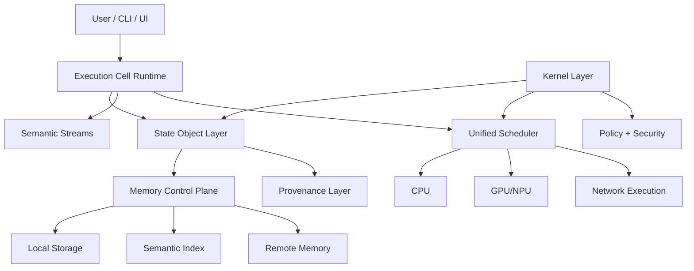

# Architecture Diagram

```mermaid
flowchart TD

User[User / CLI / UI]

User --> Cell[Execution Cell Runtime]

Cell --> State[State Object Layer]
Cell --> Stream[Semantic Streams]
Cell --> Scheduler[Unified Scheduler]

State --> Memory[Memory Control Plane]
Memory --> Local[Local Storage]
Memory --> Index[Semantic Index]
Memory --> Remote[Remote Memory]

Scheduler --> CPU[CPU]
Scheduler --> GPU[GPU/NPU]
Scheduler --> Net[Network Execution]

State --> Prov[Provenance Layer]

Kernel[Kernel Layer] --> State
Kernel --> Scheduler
Kernel --> Security[Policy + Security]
```
